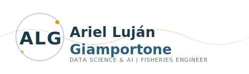

<p align="center">
  
</p>

# 📊 Fisheries Sustainability MLOps

> Deep Learning y Redes Bayesianas para Sostenibilidad Pesquera — Sistema MLOps End-to-End

[](LICENSE)
[](https://python.org)
[](https://github.com/arielgiamportone/fisheries-sustainability-mlops)
[](https://fastapi.tiangolo.com)
[](https://mlflow.org)
[](https://orcid.org/0009-0000-1607-9743)

Sistema completo de Machine Learning para predecir la sostenibilidad de operaciones pesqueras utilizando **Redes Bayesianas**, **Redes Neuronales Bayesianas (BNN)** y un stack **MLOps** completo con FastAPI, MLFlow y Optuna.

---

## Tabla de Contenidos

1. [Descripción del Proyecto](#1-descripción-del-proyecto)
2. [Para Qué Sirve](#2-para-qué-sirve)
3. [Arquitectura del Sistema](#3-arquitectura-del-sistema)
4. [Estado de Desarrollo](#4-estado-de-desarrollo)
5. [Instalación](#5-instalación)
6. [Guía de Uso Rápido](#6-guía-de-uso-rápido)
7. [Manual de Uso Completo](#7-manual-de-uso-completo)
8. [Documentación Técnica](#8-documentación-técnica)
9. [Datos y Referencias](#9-datos-y-referencias)
10. [Estructura del Proyecto](#10-estructura-del-proyecto)
11. [API Reference](#11-api-reference)
12. [Contribuir](#12-contribuir)

---

## 1. Descripción del Proyecto

### Qué es este proyecto?

Este proyecto es un sistema de inteligencia artificial end-to-end que predice si una operación pesquera es **sostenible** o **no sostenible** basándose en:

- **Variables ambientales**: temperatura del agua, salinidad, pH, clorofila
- **Variables operativas**: tamaño de flota, esfuerzo pesquero, consumo de combustible
- **Variables económicas**: precio del pescado, costos operativos

### Características Principales

| Característica | Descripción |
|----------------|-------------|
| **Redes Bayesianas** | Modelado probabilístico con estructura causal aprendida automáticamente |
| **Deep Learning** | Red Neuronal Bayesiana (BNN) que cuantifica incertidumbre en predicciones |
| **API REST** | FastAPI con endpoints para predicción, entrenamiento y gestión de modelos |
| **MLOps** | MLFlow para tracking de experimentos, versionado y registro de modelos |
| **Hyperparameter Tuning** | Optuna para optimización automática de hiperparámetros |
| **Interfaz Web** | Dashboard HTML para hacer predicciones sin código |

### Contexto y Motivación

Este proyecto nace de mi experiencia como Ingeniero Pesquero y combina conocimiento del dominio con técnicas avanzadas de ciencia de datos. Las **Redes Neuronales Bayesianas (BNNs) están virtualmente ausentes en la literatura pesquera** — esto representa una oportunidad de contribución científica original que este proyecto busca explorar.

> ⚠️ **Nota importante**: Este proyecto utiliza actualmente **datos sintéticos** generados algorítmicamente para demostrar la viabilidad metodológica. Los rangos de las variables fueron calibrados a partir de valores reportados en la literatura para pesquerías de crustáceos patagónicos. La validación con datos reales constituye la Fase 1 de la agenda de I+D+i propuesta (2026–2027).

---

## 2. Para Qué Sirve

### Casos de Uso

#### 1. Evaluación de Sostenibilidad
```
Entrada: Datos de una operación pesquera
Salida: Predicción (Sostenible/No Sostenible) + Probabilidad + Incertidumbre
```

#### 2. Análisis de Escenarios (Análisis Causal)
```
Pregunta: "Si reduzco el esfuerzo pesquero en 20%, ¿cómo cambia la probabilidad de sostenibilidad?"
Respuesta: Análisis causal con do-calculus
```

#### 3. Toma de Decisiones bajo Incertidumbre
```
Uso: Reguladores pesqueros, empresas de pesca, ONGs ambientales
Beneficio: Decisiones basadas en datos con cuantificación de incertidumbre
```

### Flujo de Trabajo Típico

```
1. Usuario ingresa datos → 2. Modelo procesa → 3. Predicción con incertidumbre
                                                         ↓
4. Dashboard muestra resultado ← 5. Decisión informada
```

---

## 3. Arquitectura del Sistema

### Diagrama de Arquitectura

```
┌─────────────────────────────────────────────────────────────────┐
│                         USUARIO                                  │
│    (Navegador Web / API Client / Jupyter Notebook)              │
└─────────────────────────────────────────────────────────────────┘
                               │
                               ▼
┌─────────────────────────────────────────────────────────────────┐
│                      CAPA DE PRESENTACIÓN                        │
│  ┌─────────────┐  ┌─────────────┐  ┌─────────────────────────┐  │
│  │  Dashboard  │  │  Formulario │  │  Swagger UI (API Docs)  │  │
│  │  (HTML/JS)  │  │  Predicción │  │  /docs                  │  │
│  └─────────────┘  └─────────────┘  └─────────────────────────┘  │
└─────────────────────────────────────────────────────────────────┘
                               │
                               ▼
┌─────────────────────────────────────────────────────────────────┐
│                      CAPA DE API (FastAPI)                       │
│  ┌──────────┐ ┌──────────┐ ┌──────────┐ ┌────────────────────┐  │
│  │ /health  │ │ /predict │ │ /train   │ │ /models /experiments│  │
│  └──────────┘ └──────────┘ └──────────┘ └────────────────────┘  │
└─────────────────────────────────────────────────────────────────┘
                               │
                               ▼
┌─────────────────────────────────────────────────────────────────┐
│                    CAPA DE SERVICIOS                             │
│  ┌─────────────────┐  ┌─────────────────┐  ┌─────────────────┐  │
│  │  ModelService   │  │  MLFlowService  │  │ TrainingService │  │
│  │  (Inferencia)   │  │  (Tracking)     │  │ (Entrenamiento) │  │
│  └─────────────────┘  └─────────────────┘  └─────────────────┘  │
└─────────────────────────────────────────────────────────────────┘
                               │
                               ▼
┌─────────────────────────────────────────────────────────────────┐
│                    CAPA DE ML/AI                                 │
│  ┌──────────────┐  ┌──────────────┐  ┌──────────────────────┐   │
│  │   Bayesian   │  │     BNN      │  │    Causal VAE        │   │
│  │   Network    │  │   (PyTorch)  │  │    (PyTorch)         │   │
│  │   (pgmpy)    │  │              │  │                      │   │
│  └──────────────┘  └──────────────┘  └──────────────────────┘   │
└─────────────────────────────────────────────────────────────────┘
                               │
                               ▼
┌─────────────────────────────────────────────────────────────────┐
│                    CAPA DE DATOS                                 │
│  ┌──────────────┐  ┌──────────────┐  ┌──────────────────────┐   │
│  │   Synthetic  │  │  Processed   │  │    MLFlow Artifacts  │   │
│  │   Generator  │  │    CSV       │  │    (Models, Metrics) │   │
│  └──────────────┘  └──────────────┘  └──────────────────────┘   │
└─────────────────────────────────────────────────────────────────┘
```

### Stack Tecnológico

| Capa | Tecnología | Versión | Propósito |
|------|------------|---------|-----------|
| **Frontend** | HTML/CSS/JS | - | Interfaz de usuario |
| **API** | FastAPI | 0.104+ | REST API |
| **ML Framework** | PyTorch | 2.0+ | Deep Learning |
| **Bayesian** | pgmpy | 0.1.24+ | Redes Bayesianas |
| **MLOps** | MLFlow | 2.9+ | Experiment tracking |
| **HP Tuning** | Optuna | 3.4+ | Optimización |
| **Validación** | Pydantic | 2.5+ | Schemas |
| **Data** | Pandas/NumPy | 2.0+/1.24+ | Procesamiento |

---

## 4. Estado de Desarrollo

### Fases Completadas

| Fase | Estado | Descripción |
|------|--------|-------------|
| **A** Fundamentos | ✅ 100% | Estructura base, redes bayesianas, validación |
| **B** Datos | ✅ 100% | Generador sintético, loaders, preprocesamiento |
| **C** Modularización | ✅ 100% | Organización en módulos, tests, config |
| **D** Deep Learning | ✅ 100% | BNN, MLP, CausalVAE, training pipeline |
| **E** MLOps | ✅ 100% | MLFlow, Optuna, FastAPI, Docker, CI/CD |

### Componentes Implementados

```
✅ Redes Bayesianas (pgmpy)
   ├── Aprendizaje de estructura (Hill Climb Search)
   ├── Estimación de parámetros (MLE, Bayesian)
   ├── Inferencia (Variable Elimination)
   └── Validación cruzada

✅ Deep Learning (PyTorch)
   ├── MLP (Multi-Layer Perceptron)
   ├── BNN (Bayesian Neural Network)
   ├── CausalVAE (Variational Autoencoder)
   └── Training con Early Stopping

✅ MLOps
   ├── MLFlow Tracking & Registry
   ├── Optuna Hyperparameter Tuning
   ├── FastAPI REST API
   ├── Docker (Dockerfile, docker-compose)
   └── GitHub Actions (CI/CD)

✅ Frontend
   ├── Dashboard principal
   ├── Formulario de predicción
   ├── Gestión de modelos
   └── Visualización de experimentos
```

### Roadmap I+D+i

| Fase | Componente | Estado | Período |
|------|------------|--------|---------|
| **1** | Validación con datos reales (INIDEP/CADIC/SIFIPA) | Pendiente | 2026-2027 |
| **1** | Calibración de priors bayesianos | Pendiente | 2026-2027 |
| **2** | Sistema clasificación sexo/talla (CNN) | Pendiente | 2027-2028 |
| **2** | Dashboard soporte a decisiones | Pendiente | 2027-2028 |
| **3** | Extensión a otras pesquerías patagónicas | Pendiente | 2028-2029 |
| **3** | Deploy AWS (ECR/ECS) en producción | Pendiente | 2028-2029 |

---

## 5. Instalación

### Requisitos Previos

- **Python**: 3.10, 3.11 o 3.12 (NO usar 3.13)
- **pip**: Versión actualizada
- **Git**: Para clonar el repositorio
- **Docker** (opcional): Para despliegue containerizado

### Paso 1: Clonar Repositorio

```bash
git clone https://github.com/arielgiamportone/fisheries-sustainability-mlops.git
cd fisheries-sustainability-mlops
```

### Paso 2: Crear Entorno Virtual

**Windows (PowerShell):**
```powershell
python -m venv .venv
.\.venv\Scripts\Activate.ps1
```

**Linux/macOS:**
```bash
python3 -m venv .venv
source .venv/bin/activate
```

### Paso 3: Instalar Dependencias

```bash
pip install --upgrade pip
pip install -r requirements.txt
pip install optuna-integration[mlflow]  # Dependencia adicional
```

### Paso 4: Verificar Instalación

```bash
python test_installation.py
```

---

## 6. Guía de Uso Rápido

### Opción A: Usar la API Web (Recomendado)

**1. Iniciar MLFlow:**
```bash
mlflow server --host 127.0.0.1 --port 5000 --backend-store-uri sqlite:///mlruns/mlflow.db --default-artifact-root ./mlruns/artifacts
```

**2. Entrenar un modelo:**
```bash
python scripts/train_api_model.py
```

**3. Iniciar la API:**
```bash
uvicorn src.api.main:app --host 127.0.0.1 --port 8000
```

**4. Abrir en navegador:**
- Dashboard: http://127.0.0.1:8000
- Predicción: http://127.0.0.1:8000/predict
- API Docs: http://127.0.0.1:8000/docs
- MLFlow: http://127.0.0.1:5000

### Opción B: Usar desde Python

```python
from data.loaders import generate_synthetic_fisheries_data, prepare_bayesian_dataset
from src.bayesian.networks import BayesianSustainabilityModel

# Generar datos
df = generate_synthetic_fisheries_data(n_samples=1000)
df_bayesian = prepare_bayesian_dataset(df, target='Sustainable')

# Entrenar modelo
model = BayesianSustainabilityModel(target='Sustainable')
model.fit(df_bayesian)

# Hacer predicción
result = model.query(
    variables=['Sustainable'],
    evidence={'CPUE_disc': 'Alto', 'Fishing_Effort_hours_disc': 'Bajo'}
)
print(f"P(Sostenible) = {result['values'][1]:.2%}")
```

### Opción C: Usar Notebooks Jupyter

```bash
jupyter notebook
# Abrir: BayesianNetworks_SostenibilidadPesquera.ipynb
```

---

## 7. Manual de Uso Completo

### 7.1 Interfaz Web

#### Dashboard (http://127.0.0.1:8000)

El dashboard muestra el estado del sistema, conexión MLFlow, modelo cargado y un formulario de predicción rápida.

#### Formulario de Predicción (http://127.0.0.1:8000/predict)

| Campo | Descripción | Rango Típico |
|-------|-------------|--------------|
| Temperatura (°C) | Temperatura superficial del mar | 15-30 |
| Salinidad (ppt) | Salinidad en partes por mil | 30-40 |
| Clorofila (mg/m³) | Concentración de clorofila | 0.1-10 |
| pH | Nivel de acidez del agua | 7.5-8.5 |
| Tamaño de Flota | Número de embarcaciones | 10-500 |
| Esfuerzo (horas) | Horas totales de pesca | 100-5000 |
| Combustible (L) | Consumo total | 500-20000 |
| Precio Pescado (USD/ton) | Precio de venta | 500-5000 |
| Precio Combustible (USD/L) | Costo del combustible | 0.5-2.5 |
| Costo Operativo (USD) | Costos totales | 5000-100000 |

### 7.2 API REST

```bash
# Predicción
curl -X POST http://127.0.0.1:8000/api/v1/predict \
  -H "Content-Type: application/json" \
  -d '{"sst_c": 25.0, "salinity_ppt": 35.0, "chlorophyll_mg_m3": 2.5, "ph": 8.1, "fleet_size": 150, "fishing_effort_hours": 1200, "fuel_consumption_l": 5000, "fish_price_usd_ton": 2500, "fuel_price_usd_l": 1.2, "operating_cost_usd": 15000}'

# Entrenamiento
curl -X POST http://127.0.0.1:8000/api/v1/train \
  -H "Content-Type: application/json" \
  -d '{"model_type": "bnn", "epochs": 100, "batch_size": 32, "register_model": true}'

# Listar modelos
curl http://127.0.0.1:8000/api/v1/models
```

### 7.3 Entrenamiento de Modelos

```bash
# Con MLFlow tracking
python scripts/train_with_mlflow.py --model-type bnn --epochs 100 --hidden-dims 64,32 --register

# Con Optuna hyperparameter tuning
python scripts/tune_hyperparams.py --model-type bnn --n-trials 50 --register
```

> 📖 Manual completo en [docs/USER_MANUAL.md](docs/USER_MANUAL.md)

---

## 8. Documentación Técnica

### Modelos de ML

#### Bayesian Neural Network (BNN)
```
Input (10) → BayesianLinear(64) → ReLU → BayesianLinear(32) → ReLU → BayesianLinear(1) → Sigmoid
```

Función de pérdida (ELBO): `ELBO = -E[log p(y|x,w)] + KL(q(w)||p(w))`

#### Red Bayesiana (pgmpy)
Modelo gráfico probabilístico con estructura causal aprendida automáticamente (Hill Climb Search) y parámetros estimados con Maximum Likelihood.

### API Endpoints

| Endpoint | Método | Descripción |
|----------|--------|-------------|
| `/health` | GET | Estado del sistema |
| `/api/v1/predict` | POST | Hacer predicción |
| `/api/v1/predict/batch` | POST | Predicciones en lote |
| `/api/v1/train` | POST | Iniciar entrenamiento |
| `/api/v1/experiments` | GET | Listar experimentos |
| `/api/v1/models` | GET | Listar modelos registrados |

> 📖 Documentación técnica completa en [docs/TECHNICAL_DOCS.md](docs/TECHNICAL_DOCS.md)

---

## 9. Datos y Referencias

### Variables del Modelo

| Variable | Tipo | Unidad | Descripción |
|----------|------|--------|-------------|
| SST_C | Ambiental | °C | Temperatura superficial del mar |
| Salinity_ppt | Ambiental | ppt | Salinidad |
| Chlorophyll_mg_m3 | Ambiental | mg/m³ | Clorofila |
| pH | Ambiental | - | Acidez del agua |
| Fleet_Size | Operativa | # | Número de embarcaciones |
| Fishing_Effort_hours | Operativa | horas | Esfuerzo pesquero total |
| Fuel_Consumption_L | Operativa | litros | Consumo de combustible |
| Fish_Price_USD_ton | Económica | USD/ton | Precio de venta |
| Fuel_Price_USD_L | Económica | USD/L | Precio del combustible |
| Operating_Cost_USD | Económica | USD | Costos operativos |
| **Sustainable** | **Target** | **0/1** | **Variable a predecir** |

### Fuentes de Datos

**Estado actual:** Datos sintéticos generados algorítmicamente, calibrados a partir de valores reportados en la literatura para pesquerías de crustáceos patagónicos.

**Fuentes reales planificadas (Fase 1 — 2026-2027):**
- Campañas de investigación INIDEP
- Registros históricos CADIC (Canal Beagle)
- Sistema SIFIPA (datos operativos)
- [Our World in Data - Fish & Overfishing](https://ourworldindata.org/fish-and-overfishing)
- [FAO FishStatJ](https://www.fao.org/fishery/statistics/software/fishstatj)

### Referencias Académicas

1. Koller, D. & Friedman, N. (2009). *Probabilistic Graphical Models*
2. Blundell et al. (2015). *Weight Uncertainty in Neural Networks*
3. FAO. (2024). *The State of World Fisheries and Aquaculture*
4. Lovrich, G.A. & Vinuesa, J.H. (1999). *Reproductive potential of Lithodes santolla*
5. Canales, C. et al. (2020). *First quantitative stock assessment for southern king crab*

### Publicación Relacionada

Giamportone, A. L. (2026). *Deep Learning y Redes Bayesianas en la Gestión de Lithodes santolla*. [Draft — ResearchGate](https://www.researchgate.net/profile/Ariel-Lujan-Giamportone)

---

## 10. Estructura del Proyecto

```
fisheries-sustainability-mlops/
├── .github/workflows/         # CI/CD pipelines
├── config/                    # Configuración YAML
├── data/                      # Generador sintético y datos procesados
├── docker/                    # Dockerfiles y compose
├── frontend/                  # Dashboard HTML/CSS/JS
├── infrastructure/            # Deploy AWS (ECR/ECS)
├── scripts/                   # Scripts de entrenamiento y tuning
├── src/
│   ├── api/                   # FastAPI (routes, schemas, services)
│   ├── bayesian/              # Redes Bayesianas (pgmpy)
│   ├── causal/                # Análisis Causal (do-calculus)
│   ├── deep_learning/         # BNN, MLP, CausalVAE (PyTorch)
│   ├── mlops/                 # MLFlow + Optuna
│   └── visualization/         # Gráficos
├── tests/                     # Tests (pytest)
├── bibliography/              # Material académico
├── docs/                      # Documentación técnica y manual
├── outputs/                   # Figuras, modelos, reportes
├── requirements.txt
├── AGENTS.md
└── README.md
```

---

## 11. API Reference

### PredictionInput
```json
{
  "sst_c": 25.0, "salinity_ppt": 35.0, "chlorophyll_mg_m3": 2.5,
  "ph": 8.1, "fleet_size": 150, "fishing_effort_hours": 1200,
  "fuel_consumption_l": 5000, "fish_price_usd_ton": 2500,
  "fuel_price_usd_l": 1.2, "operating_cost_usd": 15000
}
```

### PredictionOutput
```json
{
  "prediction": 1, "probability": 0.656,
  "confidence_interval": [0.48, 0.83], "uncertainty": 0.088,
  "model_used": "sustainability_bnn_api",
  "model_version": "Production", "inference_time_ms": 295.0
}
```

---

## 12. Contribuir

1. Fork del repositorio
2. Crear rama: `git checkout -b feature/nueva-funcionalidad`
3. Commit: `git commit -m "Agregar nueva funcionalidad"`
4. Push: `git push origin feature/nueva-funcionalidad`
5. Crear Pull Request

```bash
# Tests
pytest tests/ -v --cov=src

# Formateo
black src/ tests/

# Lint
ruff check src/ tests/
```

---

## Cómo Citar

```
Giamportone, A. L. (2026). Fisheries Sustainability MLOps: Deep Learning y 
Redes Bayesianas para Sostenibilidad Pesquera. GitHub Repository.
https://github.com/arielgiamportone/fisheries-sustainability-mlops
```

---

## Licencia

Este proyecto está bajo licencia MIT. Ver [LICENSE](LICENSE) para más detalles.

---

## 👤 Autor


**Ing. Ariel Luján Giamportone**

| | |
|---|---|
| 🎓 **Afiliación** | Universidad Tecnológica Nacional — Facultad Regional Tierra del Fuego |
| 📊 **Área** | Data Science & IA para Desarrollo Sostenible |
| 🔬 **ORCID** | [0009-0000-1607-9743](https://orcid.org/0009-0000-1607-9743) |
| 💼 **LinkedIn** | [linkedin.com/in/agiamportone](https://www.linkedin.com/in/agiamportone/) |
| 💻 **GitHub** | [github.com/arielgiamportone](https://github.com/arielgiamportone) |
| 📚 **ResearchGate** | [Ariel-Lujan-Giamportone](https://www.researchgate.net/profile/Ariel-Lujan-Giamportone) |
| 📧 **Contacto** | giamprtone1@gmail.com |

---

> 🐟 **Material educativo:** Si buscas aprender sobre estas tecnologías de forma guiada, visita el curso [Deep Learning y Redes Bayesianas para Pesquerías](https://github.com/PesquerosEnIA/curso-dl-bayesiano-pesquerias) de la comunidad [Pesqueros en IA](https://www.linkedin.com/company/110746012/).

---

⭐ Si este proyecto te fue útil, considera darle una estrella!

*Última actualización: Febrero 2026*
